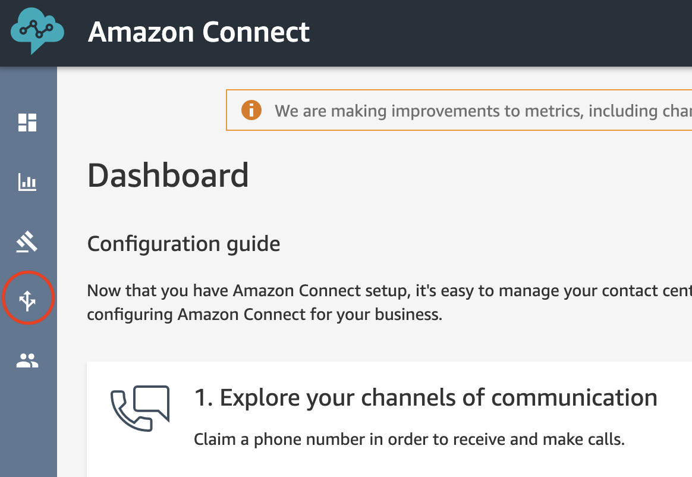
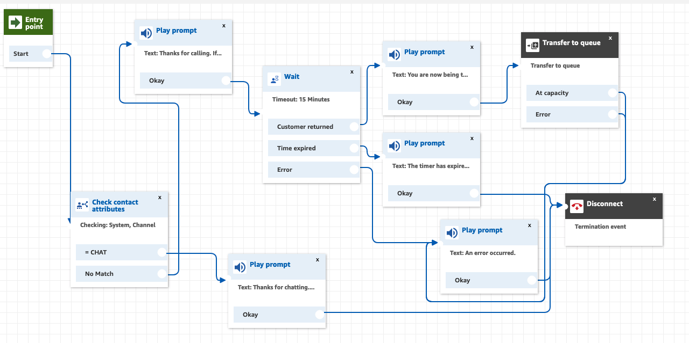

# Transfer to Amazon Connect Live Chat

This feature allows users of the Lex Web UI to have conversations with an Amazon Connect Live Agent. When the user
requests a transfer, all subsequent messages are sent to Connect Live Chat Agent and responses from the Agent are 
displayed back to the user as a message bubble. The conversation continues between user and agent until
either party disconnects. Once disconnected, messages are again sent to the Lex bot.

### TalkDesk integration

Integration with TalkDesk is also supported, but requires configuration outside of the Web UI. For a full walkthrough please refer to this [blogpost](https://aws.amazon.com/blogs/machine-learning/provide-live-agent-assistance-for-your-chatbot-users-with-amazon-lex-and-talkdesk-cloud-contact-center/).

## Setup

### Configure a Connect Instance

The following procedure configures a Connect contact flow to use for live chat. In this example, the Sample inbound
contact flow is used to handle the incoming live chat. In practice, a new inbound flow should be developed as well as a 
disconnect flow that displays a message once the session is terminated. 

1. Set up a [Connect Instance](https://docs.aws.amazon.com/connect/latest/adminguide/amazon-connect-instances.html)
2. Once you login to your instance, select **Routing** then **Contact flows**

3. Find **Sample inbound flow (first contact experience)** from the list
4. Expand **Show additional flow information** and take note of the Contact Flow ID (in blue below) and Instance ID (in red).
You are going to need to pass these values during the creation of the CloudFormation stacks below

5. If desired, [Enable Attachments]([https://docs.aws.amazon.com/connect/latest/adminguide/enable-attachments.html]) 
to attach the bot transcript as a file for the agent to review. You will also have to set the ConnectAttachChatTranscript 
CloudFormation parameter to true. When configuring CORS for the S3 bucket used for attachments, you should use the CloudFront distribution domain name (for example, 
d111111abcdef8.cloudfront.net) that is deployed with this Lex-Web-UI stack, unless you are providing a CNAME 
custom URL in front of it, in which case you should use the CNAME. In addition, the origin of the "Connect Contact
Control Panel" should also be included in the CORS definition. In sample below, 
replace "https://connectinstance.my.connect.aws" with the origin of your "Connect Contact Control Panel". If using
the default Contact Control Panel this will be the same as the origin of the "Connect Login" URL. 
In the example replace "https://d111111abcdef8.cloudfront.net" with the origin of your "lex-web-ui" distribution as noted earlier.
```
[
    {
        "AllowedHeaders": [
            "*"
        ],
        "AllowedMethods": [
            "PUT",
            "GET"
        ],
        "AllowedOrigins": [
            "https://connectinstance.my.connect.aws",
            "https://d111111abcdef8.cloudfront.net"
        ],
        "ExposeHeaders": []
    }
]
```

## Deploy or update the Lex Web UI Stack

### Using the standard distribution template (master.yaml)

Deploy a new Lex Web UI or update an existing Lex Web UI from the standard deployment repos. 

For a new stack, fill in the required values just as you would for any Lex Web Ui deployment.

At the end of the parameter list, you will notice new parameters that control enabling the Connect Live Chat feature.

1. Set ShouldEnableLiveChat to true
2. Add additional ConnectLiveChatTerms as a comma separated list if terms other than 'live chat' should be supported
3. Fill in ConnectInstanceId
4. Fill in ConnectContactFlowId
5. Change the ConnectPromptForNameMessage if desired
6. Change the ConnectWaitForAgentMessage if desired
7. Change the wait message interval, ConnectWaitForAgentMessageIntervalInSeconds, from 60 seconds to some other value if desired. 
8. Change the ConnectAgentJoinedMessage if desired. {Agent} will be replaced by the agent's name.
9. Change the ConnectAgentLeftMessage if desired. {Agent} will be replaced by the agent's name.
10. Change the ConnectChatEndedMessage if desired
11. Change ConnectAttachChatTranscript to true if you would like to also attach the chat transcript as a file. This will also require enabling chat attachments in the Amazon Connect instance, as noted above in the Configure a Connect Instance section of this document.

THe last two properties adjust the message displayed while the user is waiting for an agent and frequency of this
message. You can also control this type behavior from the contact flow. If using the contact flow to display wait
messages to the user, set the ConnectWaitForAgentMessageIntervalInSeconds to 0.

Once you have the parameters set, Create or update your stack.

### Using the pipeline template

The pipeline templates setup a new pipeline and code commit repo which deploys LexWebUi. The master-pipeline.yaml
template can be used to create a new pipeline and kick off execution of the pipeline. For a new pipeline, the same
parameters described above can be specified. When complete, the newly deployed Lex Web Ui
will have an updated lex-web-ui-loader-config.json file containing all the values specified for Connect Live Chat. 
Future modifications to connect live chat parameters should occur in the lex-web-ui-loader-config.json file and 
then be committed to code commit repo for deployment.

The new parameters configurable in lex-web-ui-loader-config.json are shown below. 

```
  "connect": {
    "contactFlowId" : "YOUR CONTACT FLOW ID",
    "instanceId" : "YOUR CONNECT INSTANCE ID",
    "apiGatewayEndpoint" : "Your newly created Amazon API Gateway endpoint",
    "promptForNameMessage": "Before starting a live chat, please tell me your name?",
    "waitingForAgentMessage": "Thanks for waiting. An agent will be with you when available.",
    "waitingForAgentMessageIntervalSeconds": 60,
    "agentJoinedMessage": "{Agent} has joined.",
    "agentLeftMessage": "{Agent} has left.", 
    "chatEndedMessage": "Chat ended.",
    "attachChatTranscript": true
  },
```

## Usage

Once the stack creation has completed, you can open the parent page hosting the Lex Web UI on your browser.
When you send a live chat request to the bot, it will intiate a POST call to a the deployed API Gateway. This Gateway uses a Lambda function to securely interact with the Connect API within your AWS account to obtain a ParticipantToken which will be used to connect the end user to the agent. This token has a TTL of one hour by default, but can be configured via the deployed Lambda function if a longer timeout is desired. Note that by default API Gateway uses TLS 1.1, if you wish to enforce higher TLS settings please follow these instructions to deploy your own [custom domains](https://docs.aws.amazon.com/apigateway/latest/developerguide/how-to-custom-domains.html).

On a separate browser window or tab, sign in as an agent on 
the [Amazon Connect Contact Control Panel (CCP)](https://docs.aws.amazon.com/connect/latest/adminguide/agent-user-guide.html) 
to receive the live agent contacts originated from the Lex Web UI.

Back on the Lex Web UI parent page, select the **menu** button on the Lex Web UI toolbar 
and then the **live chat** button to start a chat session with the agent. At this point 
the user and agent should be able to interact with each other. Users can also invoke the live chat feature using
"live chat" for text input. 

To disconnect from Live Chat, click the hangup button next to text input or use the menu to "Stop Live Chat". Note that live chat sessions have a 60-minute expiration by default, but this value can be updated in the Lambda deployed to the API Gateway if extended expiration times are desired.

## Connect Disconnect Flow logic

The LexWebUi observes messages from Connect to present responses to the user. It monitors for a specific message
to disconnect the user. This message is 'application/vnd.amazonaws.connect.event.chat.ended'. When this message is
received, the LexWebUi will terminate the live agent chat and resume normal operation chatting with the configured
Lex Bot. 

Connect sends this message when the "Disconnect" block is executed in a contact flow.

In Connect's "Sample disconnect flow", "Disconnect" is used after waiting for 15 minutes. While waiting, the LexWebUi
will continue to send messages to Connect Live Chat rather then sending messages to the Lex Bot.

If you desire to terminate Live Chat in LexWebUi as soon as the Agent terminates the chat in the CCP, configure the 
flow performing the disconnect to terminate immediately as in the following modified "Sample disconnect flow".



## Session Attributes

Connect live chat will send any Lex session attributes that are prefixed with `connect_` on the attribute key. Also, if there is a session attribute key `topic`, that will also be sent to Amazon Connect.

Session attributes can be used to branch in a contact flow to a pre-defined queue, or pass other information that the contact flow may require.  Attributes are accessible in a contact flow by using the Check contact attributes block, with the attribute type value of `User Defined`.