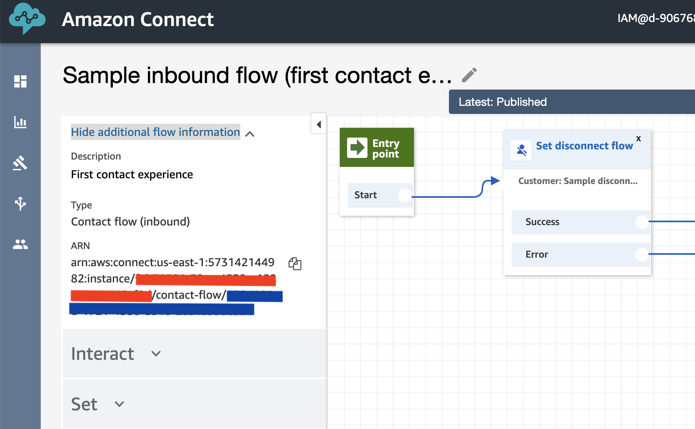

# Transfer to Amazon Connect Live Chat

This is a preview of an upcoming feature that allows the Lex Web UI to tranfer bot conversations to an Amazon Connect live agent.

## Setup

### Configure a Connect Instance

1. Set up a [Connect Instance](https://docs.aws.amazon.com/connect/latest/adminguide/amazon-connect-instances.html)
2. Once you login to your instance, select **Routing** then **Contact flows**

3. Find **Sample inbound flow (first contact experience)** from the list
4. Expand **Show additional flow information** and take note of the Contact Flow ID (in blue below) and Instance ID (in red).
You are going to need to pass these values during the creation of the CloudFormation stacks below


## Deploy the Async Customer Chat UX

1. Deploy the [Async Customer Chat UX](https://github.com/amazon-connect/amazon-connect-chat-ui-examples/tree/master/cloudformationTemplates/asyncCustomerChatUX) using the CloudFormation template in your region
2. Once Async Customer Chat UX stack has completed, take note of the `apiGatewayEndpoint` variable under the **Outputs** section of the CloudFormation console.
You are going to need to pass it during the creation of the Lex Web UI CloudFormation stack
3. Go to API Gateway console and find the API Gateway created by the CloudFormation stack in the step above
4. [Enable CORS](https://docs.aws.amazon.com/apigateway/latest/developerguide/how-to-cors-console.html) on the API Gateway `POST` method and deploy the API
5. Go to Lambda console and **find asyncCustomerChatUX-InitiateChatLambda**
6. Replace the code of the Lambda function with the code below and deploy the function

```javascript
var AWS = require('aws-sdk');
AWS.config.update({ region: process.env.REGION });
var connect = new AWS.Connect();

exports.handler = (event, context, callback) => {
    console.log("Received event: " + JSON.stringify(event));
    var body = JSON.parse(event["body"]);

    startChatContact(body).then((startChatResult) => {
        callback(null, buildSuccessfulResponse(startChatResult));
    }).catch((err) => {
        console.log("caught error " + err);
        callback(null, buildResponseFailed(err));
    });
};

function startChatContact(body) {
    var contactFlowId = "";
    if (body.hasOwnProperty('ContactFlowId')) {
        contactFlowId = body["ContactFlowId"];
    }
    console.log("CF ID: " + contactFlowId);

    var instanceId = "";
    if (body.hasOwnProperty('InstanceId')) {
        instanceId = body["InstanceId"];
    }
    console.log("Instance ID: " + instanceId);

    var initialMsgContent = "";
    var initialMsgContentType = "";
    if (body.hasOwnProperty("InitialMessage")) {
        if (body["InitialMessage"].hasOwnProperty("Content")) {
            initialMsgContent = body["InitialMessage"]["Content"];

        }
        if (body["InitialMessage"].hasOwnProperty("ContentType")) {
            initialMsgContentType = body["InitialMessage"]["ContentType"];
        }
    }

    var topic = "";
    if (body.hasOwnProperty("Attributes")) {
        if (body["Attributes"].hasOwnProperty("topic")) {
            topic = body["Attributes"]["topic"];
        }

    }

    return new Promise(function(resolve, reject) {
        var startChat = {
            "InstanceId": instanceId == "" ? process.env.INSTANCE_ID : instanceId,
            "ContactFlowId": contactFlowId == "" ? process.env.CONTACT_FLOW_ID : contactFlowId,
            "Attributes": {
                "customerName": body["ParticipantDetails"]["DisplayName"],
                "topic" : topic
            },
            "ParticipantDetails": {
                "DisplayName": body["ParticipantDetails"]["DisplayName"]
            }
        };

        if (initialMsgContent && initialMsgContentType != "" ){
            startChat.InitialMessage = {
                "Content": initialMsgContent,
                "ContentType": initialMsgContentType
            };
        };

        console.log('startChat params', startChat);
        connect.startChatContact(startChat, function(err, data) {
            if (err) {
                console.log("Error starting the chat.");
                console.log(err, err.stack);
                reject(err);
            }
            else {
                console.log("Start chat succeeded with the response: " + JSON.stringify(data));
                resolve(data);
            }
        });

    });
}

function buildSuccessfulResponse(result) {
    const response = {
        statusCode: 200,
        headers: {
            "Access-Control-Allow-Origin": "*",
            'Content-Type': 'application/json',
            'Access-Control-Allow-Credentials': true,
            'Access-Control-Allow-Headers': 'Content-Type,X-Amz-Date,Authorization,X-Api-Key,X-Amz-Security-Token'
        },
        body: JSON.stringify({
            data: { startChatResult: result }
        })
    };
    console.log("RESPONSE" + JSON.stringify(response));
    return response;
}

function buildResponseFailed(err) {
    const response = {
        statusCode: 500,
        headers: {
            "Access-Control-Allow-Origin": "*",
            'Content-Type': 'application/json',
            'Access-Control-Allow-Credentials': true,
            'Access-Control-Allow-Headers': 'Content-Type,X-Amz-Date,Authorization,X-Api-Key,X-Amz-Security-Token'
        },
        body: JSON.stringify({
            data: {
                "Error": err
            }
        })
    };
    return response;
}
```

## Deploy the Lex Web UI Stack

You need to build and deploy the Lex Web Ui from the preview feature branch. Here are the steps:

1. Clone the **`feature-connect-live-chat`** branch from the [Github repository](https://github.com/aws-samples/aws-lex-web-ui/tree/feature-connect-live-chat)
2. Deploy the code from the feature branch. See instructions below (more details on [this page](https://github.com/aws-samples/aws-lex-web-ui/blob/master/templates/README.md#regions))
    1. cd into the the root folder of the cloned repository: `cd aws-lex-web-ui`
    2. `npm install`
    3. `cd lex-web-ui`
    4. `npm install`
    5. `cd ../build`
    6. `./release.sh`
    7. create an S3 bucket in your AWS region to stage the built artifacts and code: `aws s3 mb 's3://<your-lex-bootstrap-bucket-name>' —region '<region>'`
    8. `export BUCKET=<your-lex-bootstrap-bucket-name>`
    9. ./upload-bootstrap.sh
3. Once s3 bucket has been created with contents updated, go to the CloudFormation console and create a new stack
4. Using **aws-lex-web-ui/templates/master.yaml**, create a stack.
Make sure to change the `BootstrapBucket` parameter to the bucket you created in the steps above.
Additionally, set the `ShouldEnableLiveChat` parameter to `true` and put the values from the steps above in the `ConnectContactFlowId`, `ConnectInstanceId`, `ConnectApiGatewayEndpoint` parameters

## Usage

Once the stack creation has completed, you can open the Lex Web UI test page on your browser.
The link is in the `ParentPageUrl` variable under the **Outputs** section of the CloudFormation console.

On a separate browser window or tab, sign in as an agent on the [Amazon Connect Contact Control Panel (CCP)](https://docs.aws.amazon.com/connect/latest/adminguide/agent-user-guide.html) to receive the live agent contacts originated from the Lex Web UI.

Back on the Lex Web UI parent page, select the **menu** button on the Lex Web UI toolbar and then the **live chat** button to start a chat session with the agent. At this point the user and agent should be able to interact with each other.
