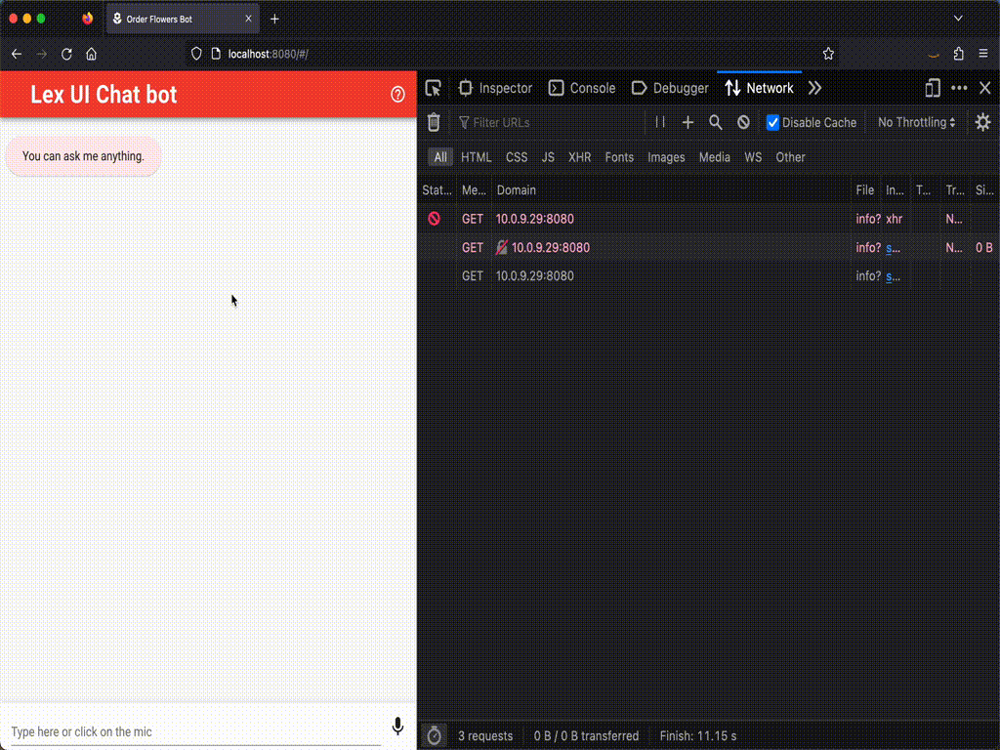

# Lex Streaming Responses

This feature allows users of the Lex Web UI to stream responses back from their bot to the Web UI client. This feature
can be used to execute long running tasks and report back progress from an API or series of API calls, or to enable
streaming responses from a large language model through services like Amazon Bedrock.

When this feature is turned on, the following architecture can be implemented to stream from your bot to the Web UI.
Note that the Cloudformation will deploy the resources on the bottom of the diagram below, but the fullfilment Lambda
must be created by the bot developer for integration with their long-running task.


## Setup

## Deploy or update the Lex Web UI Stack

To turn on streaming support for Lex Web UI, set the AllowStreamingResponses flag to true and deploy the solution.

This will run a child template in the stack, which will add the following resources:
- API Gateway WebSocket
- DynamoDB Table
- Lambda function

When your bot is first visited by a user with streaming support enabled, the bot will establish a web socket connection to 
the deployed API gateway. It will send any messages you put on the websocket back to the Web UI, enabling the user to receive
messages that have not yet 

When the final response comes back from Lex, it will replace the streamed responses with the final response and apply any custom
formating (Markdown, HTML) to the message. Note that no formatting will be applied to the streamed text.

## Creating a fullfilment Lambda that implements streaming

Once the stack creation has completed, the resources you'll need to enable streaming for Lex Web UI will be in place. However,
you will still need to implement your own fullfilment Lambda function that pushes messages to the websocket connection for the Web
UI to display.

Here is an example fullfilment lambda that could be used for integrating to Amazon Bedrock, in this case using the Claude instant model
for answering questions. In the example below, note a few important steps that will be needed for your fullfilment lambda to properly
stream to the Web UI.

1. The Lambda will need two variables from the CloudFormation template - the name of the Dynamo table that was created and the endpoint
URL of the API Gateway that was created (note that this should be an https URL not a wss URL).

2. The fullfilment Lambda must get items off the DynamoDB table, using the session ID as the key. When a user initiates a session,
the session ID is sent to the Websocket API and stored along with a connection ID in DynamoDB. The fullfilment Lambda needs to get this
value so it knows where to push its streaming updates.

3. As the response is processing (in this case our LLM is returning chunks of the response), we push these updates to our Websocket using
```apigatewaymanagementapi.post_to_connection``` which will send those updates back to the client via the Websocket connection.

```
    import boto3
    import os
    import json
    from asyncio import get_event_loop, gather, sleep

    AWS_REGION = os.environ["AWS_REGION"]
    ENDPOINT_URL = os.environ.get("ENDPOINT_URL", f'https://bedrock-runtime.{AWS_REGION}.amazonaws.com')
    modelId = "anthropic.claude-instant-v1" 
    accept = "application/json"
    contentType = "application/json"

    dynamodb_client = boto3.resource('dynamodb')
    bedrock_runtime = boto3.client(service_name='bedrock-runtime', region_name=AWS_REGION, endpoint_url=ENDPOINT_URL)
    wstable = dynamodb_client.Table('streaming-chat-table') ## Your DDB table name
    s3 = boto3.client('s3')


    ### Initialize your apigateway client
    apigatewaymanagementapi = boto3.client(
        'apigatewaymanagementapi', 
        endpoint_url = 'https://XXXXX.execute-api.us-east-1.amazonaws.com/Prod' 
        ## Your APIGateway endpoint. Format: https://{api-id}.execute-api.{region}.amazonaws.com/{stage}
    )

    def lambda_handler(event, context):
        print('event: ', event)
        response = router(event, context)
        return response   

    def router(event, context):
        intent_name = event['sessionState']['intent']['name']

        # Dispatch to your bot's intent handlers
        sess_id = event['sessionId']

        #if intent_name == 'FallbackIntent':
        result = get_event_loop().run_until_complete(openai_async_api_handler(event, context))
        print(result)
        return result        
        
        raise Exception('Intent with name ' + intent_name + ' not supported')
        
    ## Note that the prefix async
    async def openai_async_api_handler(event, context):
        
        sessionId = event['sessionId']
        inputTranscript = event['inputTranscript']
        print('sessionId ', sessionId)
        print('inputTranscript ', inputTranscript)
        db_response = wstable.get_item(Key={'sessionId': sessionId})
        print (db_response)
        connectionId = db_response['Item']['connectionId']
        print('Get ConnectionID ', connectionId)
        
        body = json.dumps({"prompt": "Human: " + inputTranscript + "Assistant:", "max_tokens_to_sample": 500})
        response = bedrock_runtime.invoke_model_with_response_stream(
            body=body, modelId=modelId, accept=accept, contentType=contentType
        )
        stream = response.get('body')
        fullreply = ''
        
        if stream:
            for streamEvent in stream:
                chunk = streamEvent.get('chunk')
                if chunk:
                    chunk_obj = json.loads(chunk.get('bytes').decode())
                    text = chunk_obj['completion']
                    fullreply = fullreply + text
                    print(text)
                    response = apigatewaymanagementapi.post_to_connection(
                        Data=text,
                        ConnectionId=connectionId
                    )
                    #display_markdown(Markdown(''.join(fullreply)))

        message = {
            'contentType': 'CustomPayload',
            'content': fullreply
        }
        fulfillment_state = "Fulfilled"
        session_attributes = get_session_attributes(event)
        return close(event, session_attributes, fulfillment_state, message)

    #------------------------------------------------------------

    def get_session_attributes(intent_request):
        print(intent_request)
        sessionState = intent_request['sessionState']
        if 'sessionAttributes' in sessionState:
            return sessionState['sessionAttributes']

        return {}


    def close(intent_request, session_attributes, fulfillment_state, message):
        intent_request['sessionState']['intent']['state'] = fulfillment_state

        return {
            'sessionState': {
                'dialogAction': {
                    'type': 'Close'
                },
                'intent': intent_request['sessionState']['intent']
            },
            'messages': [message],
            'sessionId': intent_request['sessionId'],
            'requestAttributes': intent_request['requestAttributes'] if 'requestAttributes' in intent_request else None
        }
```

## Example Demo


