### Create a user pool flow

The following images display the flow of configuration screens after selecting 
create new user pool from the AWS Cognito User Pool console. The changes and selections are
identified by the red arrows. These settings that will support
use of the User Pool by the lex-web-ui. 

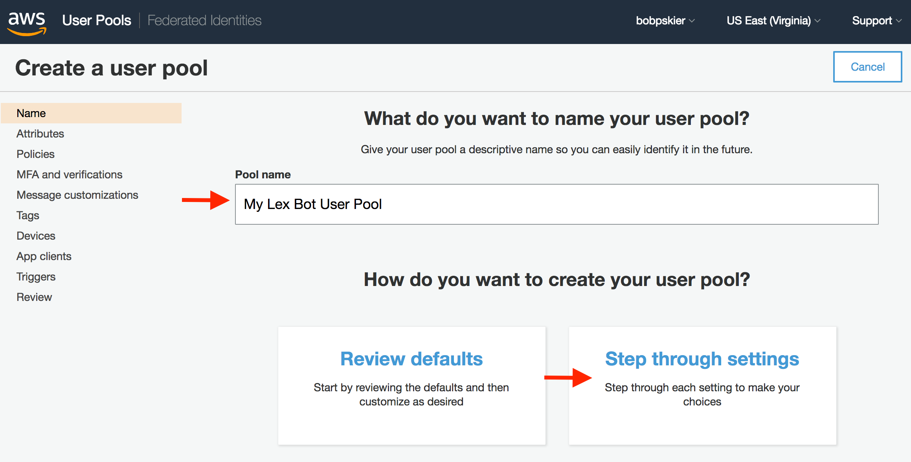
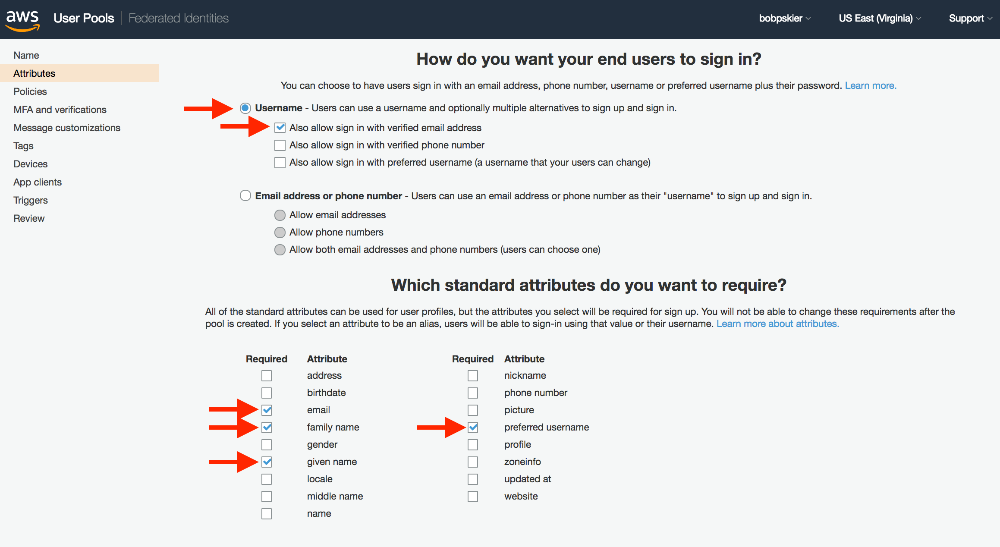
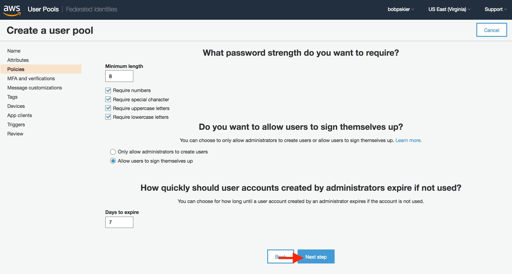
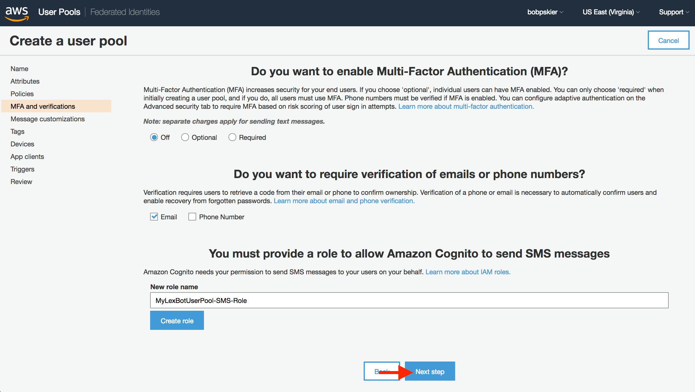
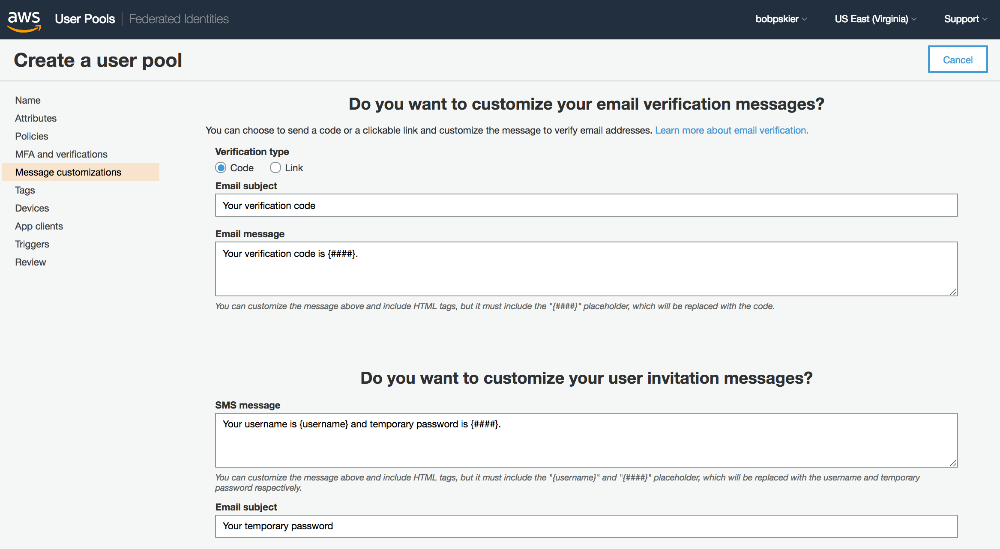
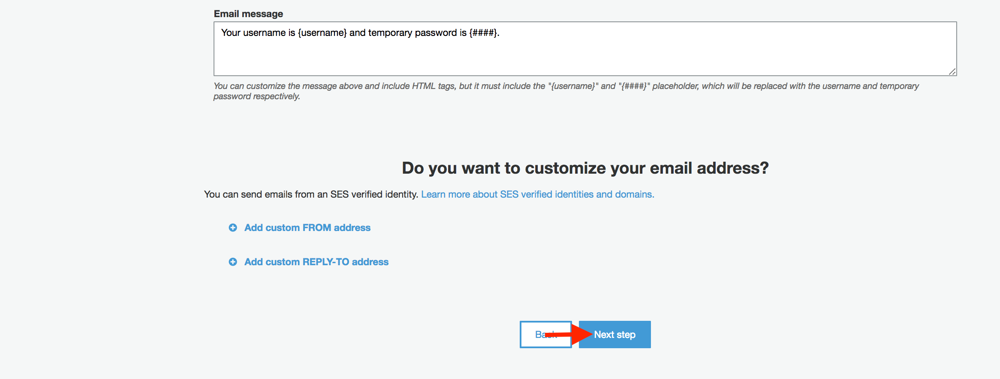
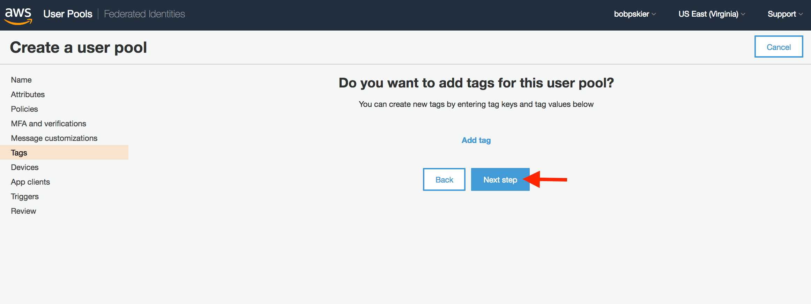

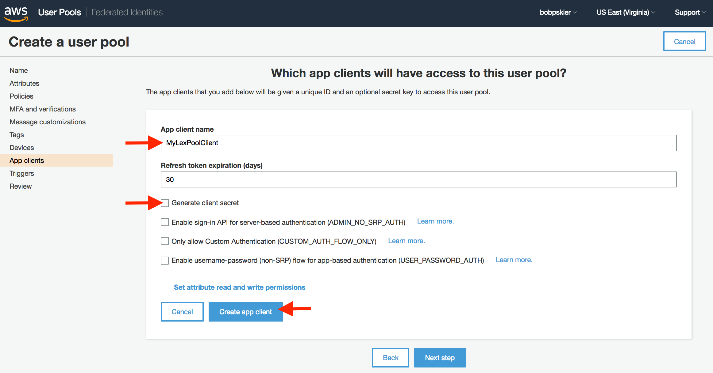
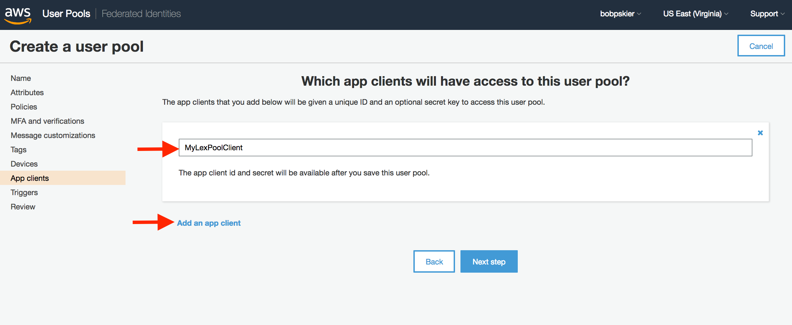
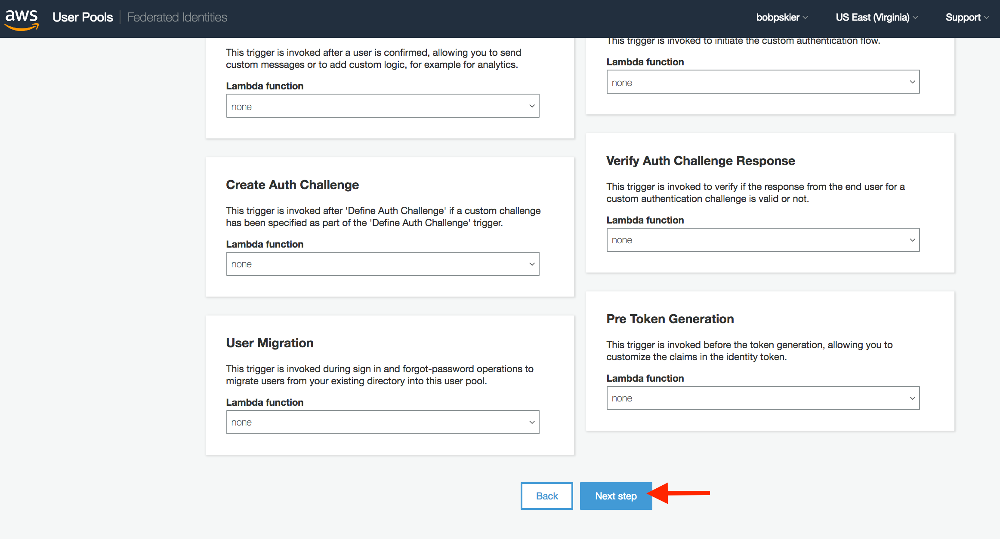
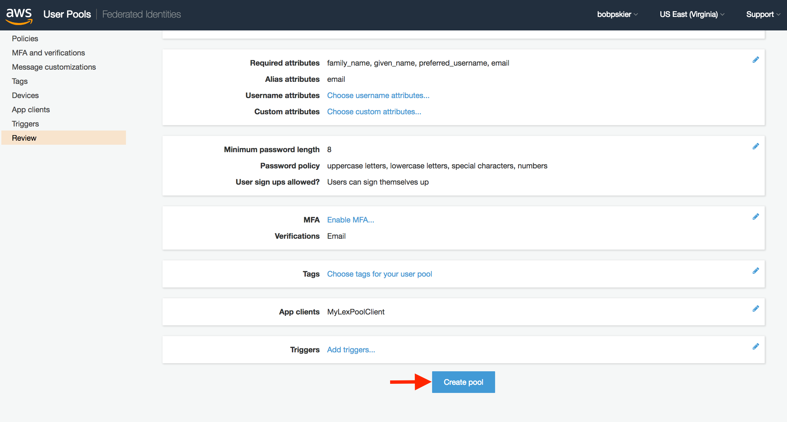
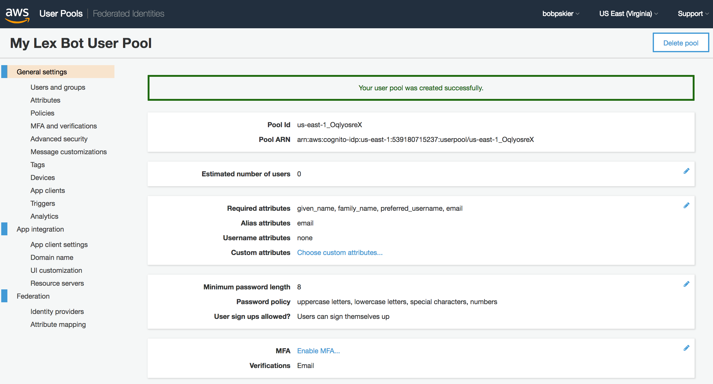

### User Pool App Client Settings

Once the user pool has been created, the pools app client settings also need to be configured.

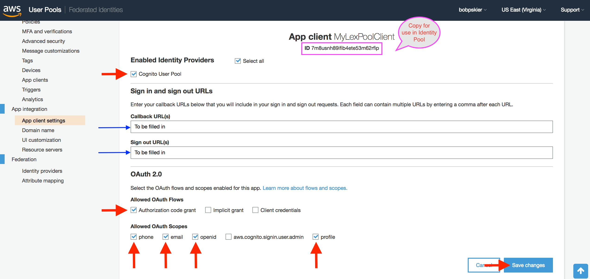

### User Pool App Domain Name

An app domain name for the User Pool also needs to be specified.

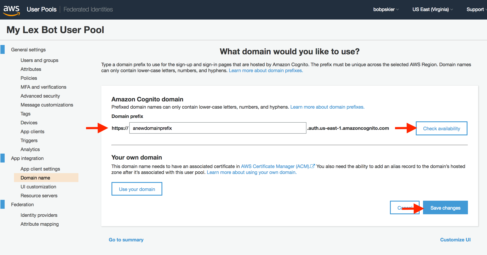

### Identity Pool Authentication Provider

Finally the Identity Pool needs to be configured to utilize the new Cognito User Pool as
the authentication provider.

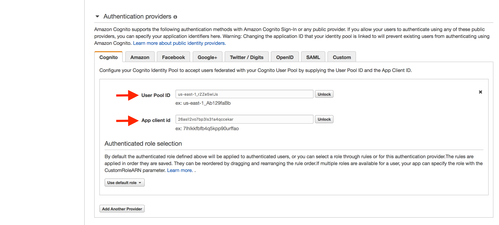
